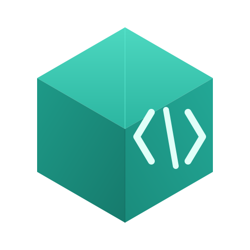

<p align="center">
  
</p>

<h1 align="center">CADML</h1>

CADML (CAD Markup Language) is a declarative XML-based language for
parametric solid modelling. This repository contains the language
specification and a C++ reference implementation.

## Status

CADML is experimental software implementing the
[CADML language specification](docs/spec/language.md). Releases are
published on the [releases page](https://github.com/miosal/CADML/releases).
The language is not stable, the specification may change without
backward-compatibility guarantees, and the implementation has not been
hardened against
hostile input — it has not undergone a security audit and may
contain memory-safety bugs or input-validation gaps when parsing or
evaluating untrusted `.cadml` sources. Do not use it for anything
you cannot afford to break or re-author.

## Repository layout

```
docs/               Language specification and implementation documentation
examples/           Sample .cadml projects
src/cadml/          Parser, types, expressions, Lua runtime
src/cadml_compile/  Bundler (lowers .cadml to .fcadml)
src/engine/         Flat evaluator, exporters, analysis
src/cli/            Command-line binaries
src/wasm/           WebAssembly bindings
tests/              Cross-cutting test suites
web/                Next.js homepage (independent project)
```

## Build

Requires CMake 3.24+ and a C++20 compiler. All third-party
dependencies are fetched and built from source via CMake's
FetchContent; no system install is required.

```bash
cmake --preset default
cmake --build --preset default
ctest --preset default
```

Binaries land under `build/<OS>/bin/`. Example:

```bash
./build/Linux/bin/cadmlstl examples/hex-bolt/hex-bolt.cadml -o hex-bolt.stl
```

The WebAssembly build requires the Emscripten SDK on `PATH`:

```bash
cmake --preset wasm
cmake --build --preset wasm
```

Outputs are `build/wasm/cadml.js` and `cadml.wasm`.

## CLI tools

`src/cli/` produces 13 binaries: `cadmlc`, `cadmlbuild`, `cadmlcheck`,
`cadmlstl`, `cadml3mf`, `cadmlmass`, `cadmlbounds`, `cadmltopo`,
`cadmldiff`, `cadmlmeasure`, `cadmlholes`, `cadmlwalls`, `cadmllsp`.
Each accepts `-h` / `--help`.

## Web app

The `web/` directory is an independent Next.js project hosting the
project homepage and running the WASM build in-browser. See
[`web/README.md`](web/README.md) for build instructions.

## Documentation

The normative specification is
[`docs/spec/language.md`](docs/spec/language.md). Companion documents
in `docs/` cover the expression mini-language, SVG path subset,
coordinate system, flat IR, parser internals, evaluator semantics,
exporters, Lua embedding, error model, and architecture.

## License

[Apache License 2.0](LICENSE). Third-party attributions in
[`NOTICE`](NOTICE).
